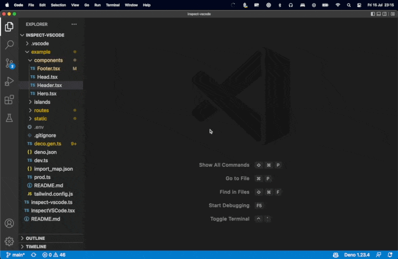

# Inspect in VSCode

This is a simple extension for [deno/fresh](https://fresh.deno.dev) projects that allows you to inspect your components' source code in VSCode. This repository includes a sample site to show how it works. Activate the extension with `backquote` (\`) and click on any component. Your browser will attempt to navigate to the source code file in your project.



This is a native feature in [`live`](https://github.com/deco-cx/live), the upcoming deno-native CMS.

### Usage

Start the project:

```
cd example/
deno task start
```

Go to https://localhost:8080

Now hit the backquote key (`) and click on any DOM Element while the project is open in VSCode. Your browser should navigate to VSCode and open the correct file and line.

### Implementing in your project

- Add `"inspect-vscode/": "https://deno.land/x/inspect-vscode/",` to your `import_map.json` file.
- Create `islands/InspectVSCode.tsx`:
```tsx
/** @jsx h */
import { h } from "preact";
import { useEffect } from "preact/hooks";
import { DomInspector } from "inspect-vscode/InspectVSCode.tsx";

declare global {
  interface Window {
    inspectVSCode: DomInspector;
  }
}

export default function InspectVSCode() {
  useEffect(() => {
    window.inspectVSCode = new DomInspector(document.body);
  });
  return <span></span>;
}
```
- Create `routes/inspect-vscode.ts`:
```tsx
import { handler as InspectVSCode } from "inspect-vscode/inspect-vscode.ts";

export const handler = InspectVSCode;
```
- Import `islands/InspectVSCode.tsx` in a route and render it.

Done!

### How this works

It's really quite simple! 

First, the client-side script activates the hover. 

When an element is clicked, its `outerHTML` is sent to the server as a `POST` to `/inspect-vscode`.

The route handler then parses the `outerHTML` and `greps` the first complete HTML element. 

If that fails — which happens when the element is formatted in multiple lines — we fallback to `grep`ing the longest attribute. This generally works.


### Known Limitations

- Better implementations for multi-line search are welcome. Right now, we're using grep for wider compatibility. There is no native tool for multiline regex search in MacOS and I wouldn't want to require installing a new package for that.
- Twind syntax (tw\`...\`) is not supported — in fact, any transformation on the element causes grep to fail. I would welcome a PR which adds support for transformed HTML by using fuzzy search, something like https://deno.land/x/fzf@v0.5.1 
- Components which are very similar might not be detected precisely: the first occurence will be found every time.

